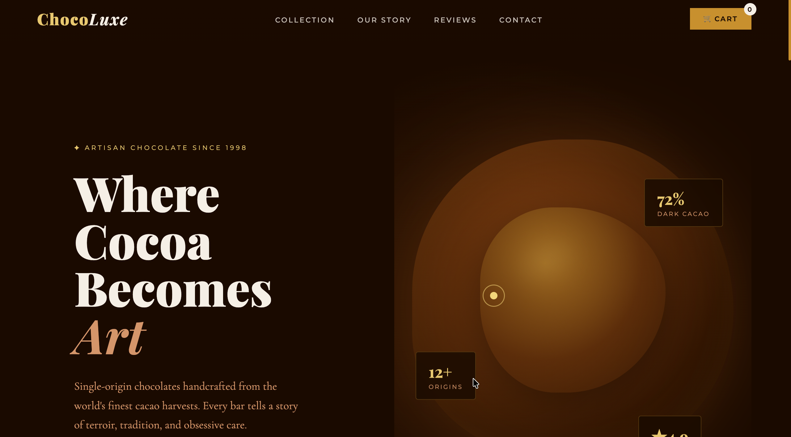
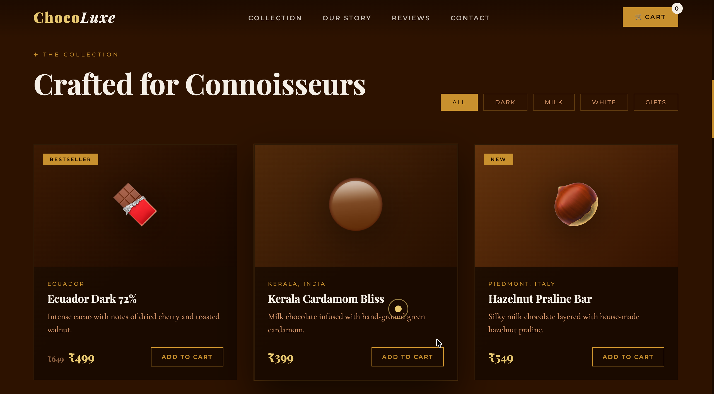
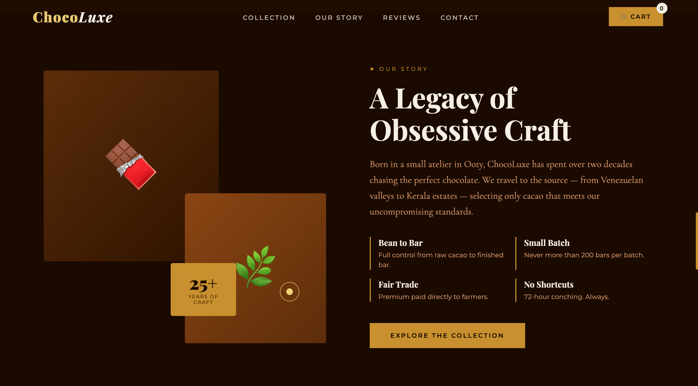
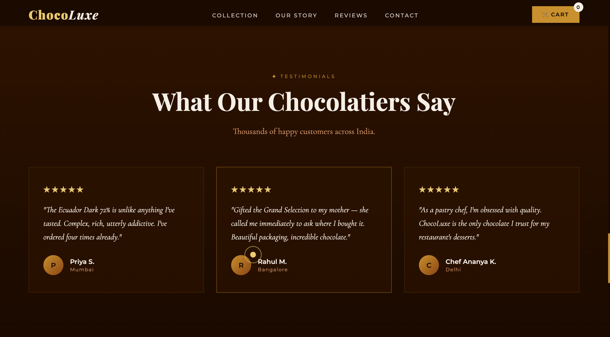

# 🍫 ChocoLuxe

<p align="center">
  <b>Where Cocoa Becomes Art</b><br>
  A premium, design-first chocolate e-commerce experience
</p>

<p align="center">
  <a href="https://your-live-link.vercel.app">🌐 Live Demo</a> •
  <a href="https://github.com/your-username/chocoluxe">📂 Repository</a>
</p>

---

## 🎬 Experience

⭐ **Experience the website live here:**  
👉 https://akash-wakade-7008-alt.github.io/ChocoLuxe/

---

## 🖼️ Preview

<p align="center">
<p>🏠 Hero Section</p>
  <br>
</p>

<p align="center">
  <p>🍫 Product Collection</p>
  <br>

</p>

<p align="center">
  <p>📖 Our Story</p>
  <br>

</p>

<p align="center">
  <p>⭐ Testimonials</p>
  <br>

</p>

---

## 📂 Project Structure

```
ChocoLuxe/
│── index.html
│── style.css
│── script.js
│── images/
│   ├──Preview-1
│   ├──Preview-2
│   ├──Preview-3
│   ├──Preview-4
│── README.md
```

---

## ⚙️ Local Setup

### Option 1: Clone the Repository

```bash
git clone https://github.com/Akash-Wakade-7008-alt/ChocoLuxe.git

cd ChocLuxe

open index.html
```

### 📦 Option 2: Download ZIP

Download the project directly:  
👉 https://github.com/Akash-Wakade-7008-alt/ChocoLuxe/releases/download/chocoLuxe-2.0/ChocoLuxe.zip

1. Download the ZIP file
2. Extract it
3. Open `index.html` in your browser

## 🛠️ Tech Stack

- HTML5
- CSS3 (Flexbox & Grid)
- JavaScript

---

## ✨ Concept

ChocoLuxe is a refined frontend experience that presents artisan chocolate as a blend of craft, origin, and indulgence.  
The goal is to transform a simple product interface into something luxurious and intentional.

---

## 🖼️ Experience Highlights

### 🏠 Hero Section

A bold entry point with rich tones and elegant typography.

### 🍫 Curated Collection

- Categories: Dark, Milk, White, Gifts
- Featured: Bestsellers & New Arrivals
- Clean, premium product cards

### 📖 Brand Story

- Ingredient sourcing
- Small-batch production
- Craftsmanship

### ⭐ Testimonials

Subtle social proof that builds trust while maintaining the aesthetic.

---

## 🚀 Features

- Luxury-inspired UI design
- Fully responsive layout
- Product showcase with categories
- Smooth interactions
- Story-driven layout

---

## 🎯 Roadmap

- Functional shopping cart
- Payment integration
- Authentication system
- Order tracking
- Deployment (Vercel / Netlify)

---

## 💡 Design Philosophy

Inspired by premium brands that focus on:

- Strong typography
- Minimal layouts
- Warm color palettes
- Storytelling

---

## 👤 Author

Akash Wakade  
Aspiring Software Developer — Web Dev & AI

---
